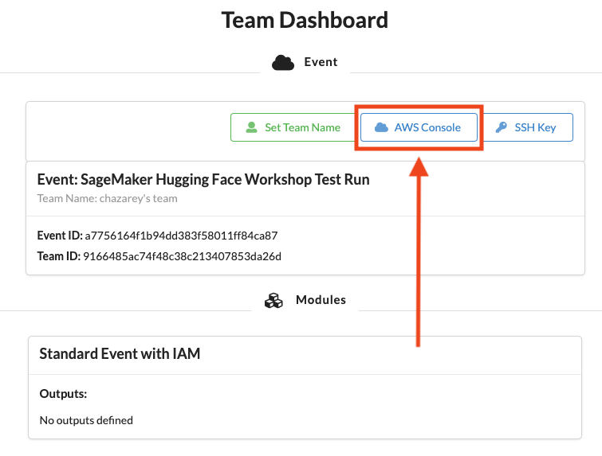
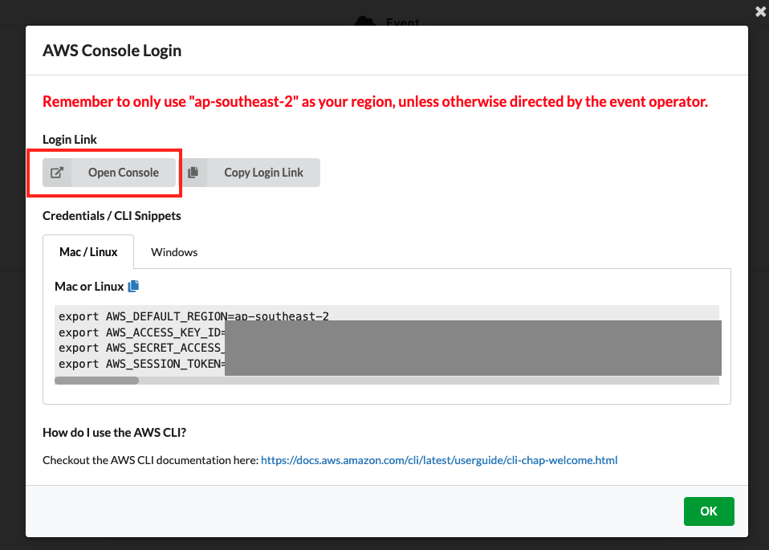
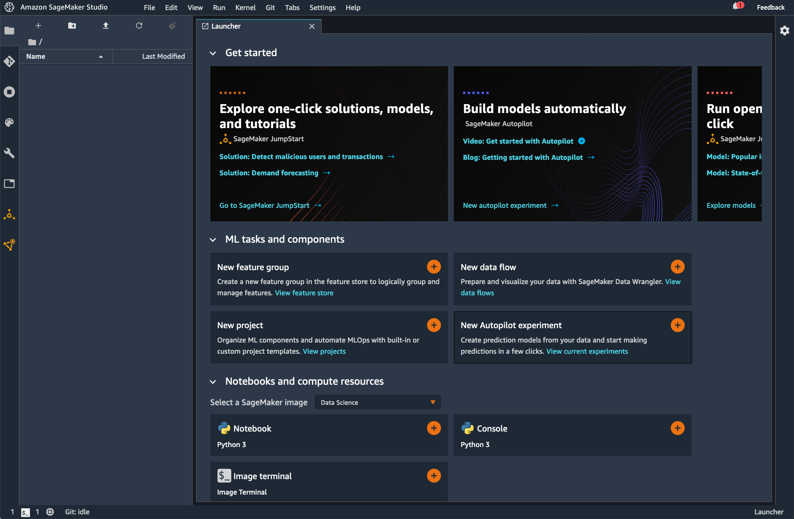

## Amazon SageMaker Deployment Workshop

In this workshop we are going to cover: 

* Register and deploy pre-trained hugging face models to Amazon SageMaker for real-time inference 
* Multimodel endpoint deployment 
* A/B testing using production variants
* Deployment guardrials with blue/green deployment
* Benchmark inference payload with API gateway + lambda

# Getting Started

For this workshop you’ll get access to a temporary AWS Account already pre-configured with Amazon SageMaker Studio. Follow the steps in this section to login to your AWS Account and download the workshop material.

### 1. To get started navigate to - https://dashboard.eventengine.run/login 

Click on Accept Terms & Login

### 2. Click on Email One-Time OTP (Allow for up to 2 mins to receive the passcode)

### 3. Provide your email address

### 4. Enter your OTP code

### 5. Click on AWS Console

### 6. Click on Open AWS Console (

### 7. In the AWS Console click on Amazon SageMaker

### 8. Click on Amazon SageMaker Studio and then click on Open Studio

### 9. You should now have Amazon SageMaker Studio interface open on your browser

### 10. Open a new terminal window

### 11. Clone the workshop content

In the terminal paste the following command to clone the workshop content repo:

`git clone https://github.com/aws-samples/amazon-sagemaker-deployment-workshop.git`

### 12. Rejoin the presenter for a live walkthrough of the workshop

## Security

See [CONTRIBUTING](CONTRIBUTING.md#security-issue-notifications) for more information.

## License

This library is licensed under the MIT-0 License. See the LICENSE file.

